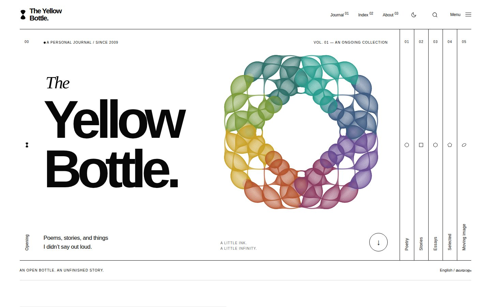

# The Yellow Bottle

A custom white-and-black journal for Arun Viswanathan, in light or dark. It has oversized typography, narrow chapter rails, moving mathematical artwork in colour, and a quiet reading view with comments, sharing and likes. English and Malayalam are both supported.



## Use it

- **`the-yellow-bottle.xml`** is the complete, self-contained Blogger theme. This is the file to install.
- **`index.html`** is an interactive, standalone design preview. Open it in a browser. Its five entries are illustrative samples from the supplied mockup, not live posts.

To install, save a backup of the existing theme in **Blogger → Theme → menu → Backup**. Then use **Restore → Upload** with `the-yellow-bottle.xml`, or paste its full contents into **Edit HTML**. Blogger themes use XML containing HTML, CSS, JavaScript, and Blogger template expressions; the ordinary HTML preview cannot be installed as a theme.

If Blogger offers a separate mobile theme, choose the desktop/custom theme for mobile so this theme’s responsive layout is used. Preview a home page, a Malayalam post, a label page, a static page, and a comment thread before applying it to the public blog.

## What is included

- Pure white background, black text and graphic elements, grayscale rules — with a true dark mode (manual toggle, honours system preference, no flash on load).
- Original mathematical SVG artwork: a hand-generated infinity curve (lemniscate) crossed by orbiting rings, which rearranges into two further quiet compositions when clicked or keyboard-activated. No stock icon shapes anywhere — the wordmark and the five chapter markers are all built from the same circle/polygon geometry.
- The About section shows a moving line portrait of the author. Its wave lines ripple harder where the photo is darker, and a band of colour sweeps across every line at the same moment. The cursor steers it, and a click switches to a ring halftone. It is inverted in dark mode so it stays a positive image. Only a 68×110 grid of tone values (`src/portrait.json`) is stored, not the photo.
- Interface icons follow the open-source [Feather](https://github.com/feathericons/feather) icon set (MIT), redrawn as inline SVG so the theme stays a single self-contained file.
- The drawings use the formulas Hamid Naderi Yeganeh published in [“Making Mathematical Art”](https://www.scientificamerican.com/article/making-mathematical-art/) (*Scientific American*): 14,000, 12,000, 10,000 and 9,000 circles, 8,000 and 4,000 line segments, and 8,000 and 7,000 arcs. The page draws each element from the published formula for its centre, radius or end points (`src/figures.js`). A slow clock turns the inner terms, so the figures keep flowing; they lean toward the cursor and change to the next formula when clicked. Colour is yellow with ink (black on white, white on black); some figures add a third quiet tone (teal or clay). The opening figure is large on every screen size. The artwork is credited to Hamid Naderi Yeganeh.
- The opening is a row of numbered panels in the manner of G!theimagineers: on desktop a chapter tab (01–05) unfolds that chapter in place, each with its own figure. On phones the tabs stay links to the label pages.
- Menu, search and the monthly index open as a curtain from the right. The menu carries a small gallery of four figures.
- If Blogger ever returns an empty post list or index, the page rebuilds it from the blog's own public feed, so writing is never missing.
- Edits made in the Blogger dashboard always show. A remembered copy of a post opens instantly, but the live version is fetched each time and replaces the copy when the post has changed. Lists and excerpts are refreshed in the same way.
- Every post ends with a like, a share button and the comments:
  - **Like:** a burst of coloured lines, not a heart, with a shared counter. Blogger has no like counter of its own, so this count is separate from Blogger. Each browser counts once. The count is kept by the free [CounterAPI](https://counterapi.dev) service (namespace `the-yellow-bottle`). If that service is unreachable, the like still animates and the number is simply hidden. Point `window.TYB_LIKES_API` at another compatible counter to change it.
  - **Share:** a black button with a white line icon. It opens the phone's own share sheet, or on a computer a menu for WhatsApp, Facebook, X, Telegram, email and copy link.
  - **Comments:** listed from the post's Blogger comment feed, with Blogger's own comment form (sign-in, moderation and notifications all stay in Blogger). A link opens the same form in a new window. When Blogger renders its native comment form, that form is used instead.
- Full-screen menu and search, keyboard focus containment, Escape to close. Search shows results as you type: titles, labels and excerpts of every post are matched instantly (English or Malayalam, partial words included), then Blogger's own full-text search adds deeper matches.
- Native Blogger posts, permalinks, labels, pagination, static pages, monthly archive, and comments.
- Post images remain in their original colours. The interface is monochrome in both themes; only the artwork and the like carry colour.
- Native post/search/archive rendering works without JavaScript. JavaScript adds the overlays, artwork, theme toggle, reading-size preference, copy link, and progress indicator.
- Reduced-motion support, responsive media, Malayalam font support, and a print reading layout.
- The exact supplied copyright line with the **Copyright and Content Use** link.

Only two invisible-to-the-design Blogger data components remain: `Blog1` supplies posts and comments; `BlogArchive1` supplies the monthly index (shown in the Index overlay). There are no sidebar gadgets, ad placements, popular-post panels, or stock Blogger navigation styles.

The production XML contains no sample posts. The home page automatically features the newest post and lists the remaining posts once. Search uses Blogger’s native search endpoint; label links use the existing blog labels:

Each chapter gathers several existing Blogger labels. The chapter link opens the first label's page; with JavaScript the page merges every label in the group, removes duplicates, and lists newest first. Edit the groups in `CATEGORY_LABELS` in `scripts/build.py`.

| Chapter | Blogger labels |
| --- | --- |
| Poetry / കവിതകൾ | `ente kavithakal`, `My Poems`, `Poems`, `poem`, `poetry`, `Slam poetry` |
| Stories / കഥകൾ | `ente kathakal`, `Stories`, `The come out story` |
| Essays / ലേഖനങ്ങൾ | `Article`, `My article`, `My experiences`, `My diary` |
| Selected / തിരഞ്ഞെടുത്ത | `My picks` |
| Moving image / വീഡിയോസ് | `Video` |

The `post.date`, `post.author.name`, and native comment structures target Blogger layout version 3 / widget version 2, matching the supplied current theme. Comments retain Blogger’s native rendering, authentication, reply, moderation, and paging mechanisms.

## Edit and rebuild

```sh
python3 scripts/build.py
python3 scripts/validate.py
```

No package installation or external build service is required. `src/theme.css` and `src/theme.js` are shared by the preview and installed theme. `src/frame.html` controls navigation, footer, and overlays. `src/hero.html` controls the opening composition. `src/blogger-main.xml` binds the design to Blogger data. The build inlines everything into the two deliverables, apart from Google Fonts and media already hosted in blog posts. System fonts are fallbacks when Google Fonts is unavailable.

Font sizes, white/black values, and spacing are at the top of `src/theme.css`. Categories are in `scripts/build.py`. Update the brand/footer in `src/frame.html`. Do not edit only the generated files, because the next build replaces them.

## Design references

The supplied references informed different aspects of the design; their assets and source code are not used:

- [G!theimagineers](https://www.gtheimagineers.com/en.html): fine divisions, geometric forms, narrow chapter navigation, translated to a white canvas.
- [Benjamin Righetti](https://benjaminrighetti.netlify.app/): oversized type and a spacious opening composition.
- [Murmure Journal](https://murmure.me/journal/): expressive scale and an editorial writing index.
- [Stuurmen](https://stuur.men/): strong typography and minimal hierarchy.
- [Bruno Arizio](https://brunoarizio.com/): asymmetry and small, carefully placed metadata.
- [Trip in the dark](https://tripinthedark.ru/en): discovery through interaction and paced transitions.

Blogger implementation references: [widget tags](https://support.google.com/blogger/answer/46995?hl=en), [data tags](https://support.google.com/blogger/answer/47270?hl=en), and [page elements](https://support.google.com/blogger/answer/46888?hl=en). Native comment includables were adapted from the user-supplied existing theme.

Local XML validation is not Blogger’s server-side import validation. See `docs/validation.md` for the actual checks completed and remaining platform checks.
